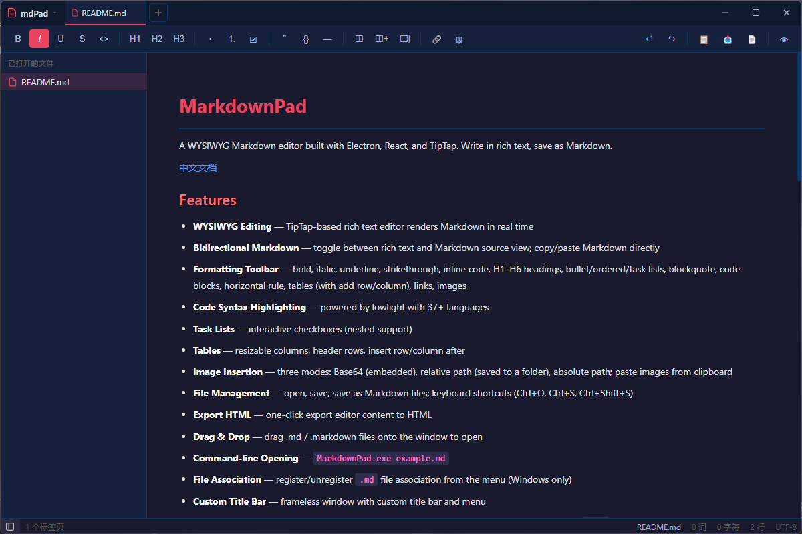

# MarkdownPad

A WYSIWYG Markdown editor built with Electron, React, and TipTap. Write in rich text, save as Markdown.

[中文文档](./README.md)



## Features

- **WYSIWYG Editing** — TipTap-based rich text editor renders Markdown in real time
- **Bidirectional Markdown** — toggle between rich text and Markdown source view; copy/paste Markdown directly
- **Formatting Toolbar** — bold, italic, underline, strikethrough, inline code, H1–H6 headings, bullet/ordered/task lists, blockquote, code blocks, horizontal rule, tables (with add row/column), links, images
- **Code Syntax Highlighting** — powered by lowlight with 11+ languages
- **Task Lists** — interactive checkboxes (nested support)
- **Tables** — resizable columns, header rows, insert/delete rows/columns, merge/split cells
- **Image Insertion** — three modes: Base64 (embedded), relative path (saved to a folder), absolute path; paste images from clipboard
- **Multi-tab Editing** — edit multiple files simultaneously with tab switching and middle-click close
- **Sidebar** — browse open files list or browse .md files in a folder
- **Right-click Context Menu** — quick access to formatting, table operations, and editing commands
- **Status Bar** — real-time word count, character count, line count, encoding, and modification status
- **Undo/Redo** — toolbar undo/redo buttons
- **File Management** — open, save, save as Markdown files; support multi-file selection and opening folders
- **Export HTML** — one-click export editor content to HTML
- **Drag & Drop** — drag .md / .markdown files onto the window to open
- **Command-line Opening** — `MarkdownPad.exe example.md`
- **File Association** — register/unregister `.md` file association from the menu (Windows only)
- **Custom Title Bar** — frameless window with custom title bar, tab bar, and menu
- **Theme System** — dark (default) and light themes built in; select in settings, add custom CSS themes by placing `.css` files in the themes folder
- **Font Settings** — customize editor font family and font size in settings
- **Customizable Shortcuts** — customize keyboard shortcuts (new, open, save, save as, sidebar toggle)
- **Hardware Acceleration Toggle** — switch hardware acceleration mode (auto/always on/disabled)
- **Window Modes** — center, auto-remember position, or fixed position on startup
- **Default Open Path** — set a folder or file to auto-open on app startup
- **Spellcheck Toggle** — enable/disable browser spellcheck in settings
- **Toolbar Visibility Toggle** — show/hide the toolbar in settings
- **Last Tab Behavior** — configure close app or create new tab when closing the last tab
- **About Dialog** — view app version, tech stack, and runtime information
- **Single Instance** — prevents multiple instances, forwards opened files to the running instance

## Install

Download the latest installer from the [Releases](https://github.com/anomalyco/markdownpad/releases) page.

### Prerequisites

- Windows x64 (NSIS installer)
- Node.js &gt;= 18 (for development)

## Development

```bash
# Install dependencies
npm install

# Generate app icon
npm run generate-icon

# Start dev server with HMR
npm run dev

# Production build
npm run build

# Package into Windows installer
npm run pack
```

The packaged installer will be in the `release/` directory.

## Project Structure

```
src/
  main/index.js              — Electron main process (window, IPC, themes, file assoc, single instance)
  preload/index.js           — contextBridge (electronAPI for renderer)
  renderer/
    index.html               — entry HTML
    src/
      main.jsx               — React mount
      App.jsx                — editor setup, all extensions, multi-tab management, Markdown preview
      components/
        TitleBar.jsx         — custom frameless title bar with tab bar and menu
        Toolbar.jsx          — formatting toolbar
        Sidebar.jsx          — sidebar (file list / folder browser)
        StatusBar.jsx        — status bar (word count, stats)
        ContextMenu.jsx      — right-click context menu
        SettingsDialog.jsx   — settings (theme, font, shortcuts, hardware acceleration, etc.)
        AboutDialog.jsx      — about dialog
      styles/
        index.css            — reset + base styles
        editor.css           — editor, toolbar, preview, sidebar, status bar, scrollbar styles
```

## Tech Stack

| Tech | Purpose |
| --- | --- |
| Electron 33 | Desktop framework |
| React 18 | UI |
| Vite 5 (electron-vite) | Build tool |
| TipTap 2 (ProseMirror) | Rich text engine |
| tiptap-markdown | Markdown ↔ WYSIWYG conversion |
| lowlight | Code syntax highlighting |

## License

MIT

---

*This project was entirely generated using [opencode](https://opencode.ai) with DeepSeek V4 Flash model.*
