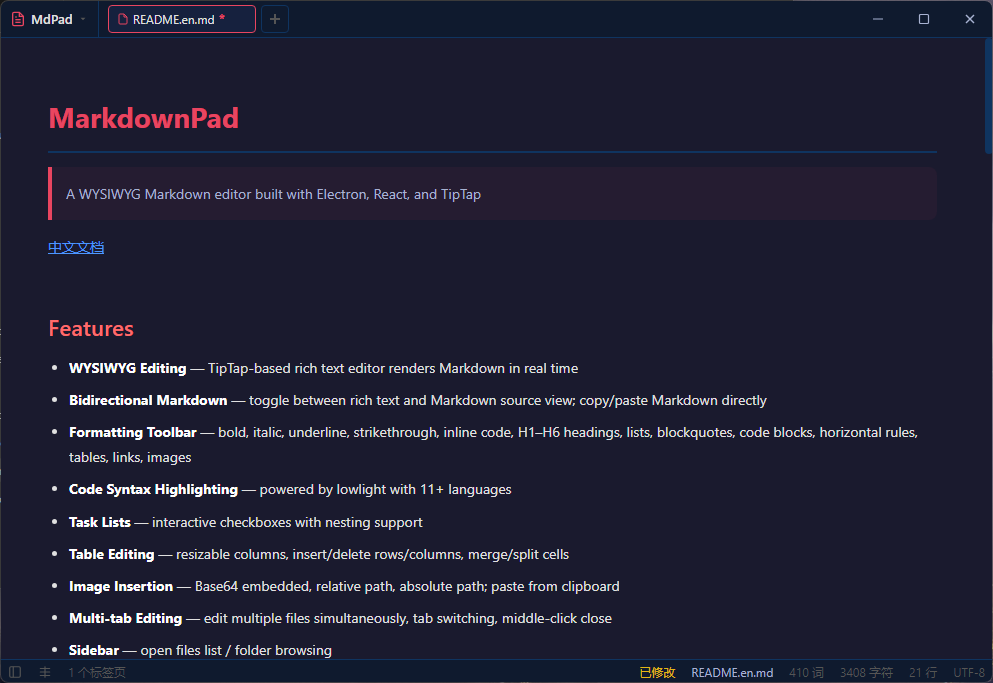

# MarkFree

> A MarkFree editor built with Electron, React, and TipTap

[中文文档](./README.md)



## Features

- **WYSIWYG Editing** — TipTap-based rich text editor renders Markdown in real time
- **Bidirectional Markdown** — toggle between rich text and Markdown source view; copy/paste Markdown directly
- **Formatting Toolbar** — bold, italic, underline, strikethrough, inline code, H1–H6 headings, lists, blockquotes, code blocks, horizontal rules, tables, links, images
- **Code Syntax Highlighting** — powered by lowlight with 11+ languages
- **Task Lists** — interactive checkboxes with nesting support
- **Table Editing** — resizable columns, insert/delete rows/columns, merge/split cells
- **Image Insertion** — Base64 embedded, relative path, absolute path; paste from clipboard
- **Multi-tab Editing** — edit multiple files simultaneously, tab switching, middle-click close
- **Sidebar** — open files list / folder browsing
- **Context Menu** — right-click for formatting, table operations, editing commands
- **Status Bar** — real-time word count, character count, line count, encoding, modification status
- **File Management** — open, save, save as; multi-file selection, folder opening
- **Export HTML** — one-click export to HTML
- **Drag & Drop** — drag .md/.markdown files onto the window to open
- **Command-line Opening** — `MarkFree.exe example.md`
- **File Association** — register/unregister .md association (Windows)
- **Custom Title Bar** — frameless window with custom title bar and tab bar
- **Theme System** — dark (default) and light themes built in, custom CSS theme support
- **Font Settings** — customize editor font and size
- **Customizable Shortcuts** — customize keyboard shortcuts
- **Hardware Acceleration Toggle** — auto / always on / disabled
- **Window Modes** — center, auto-remember, fixed position
- **Default Open Path** — auto-open folder or file on startup
- **Spellcheck Toggle**
- **Toolbar Visibility Toggle**
- **Last Tab Behavior** — close app or create new tab
- **About Dialog** — version, tech stack, runtime info
- **Single Instance** — prevents multiple instances, forwards files to running instance

## Install

Download the latest installer from the [Releases](https://github.com/anomalyco/markfree/releases) page.

### Prerequisites

- Windows x64
- Node.js &gt;= 18 (for development)

## Development

```bash
# Install dependencies
npm install

# Generate app icon
npm run generate-icon

# Start dev server with HMR
npm run dev

# Production build
npm run build

# Package Windows installer + portable
npm run pack:win
```

Packaged artifacts will be in the `dist/` directory.

## Project Structure

```
src/
  main/index.js              — Main process (window, IPC, themes, file assoc, single instance)
  preload/index.js           — contextBridge (electronAPI)`
  renderer/
    index.html               — Entry HTML
    src/
      main.jsx               — React mount
      App.jsx                — Editor setup, extensions, multi-tab management
      components/
        TitleBar.jsx         — Title bar, tab bar, menu
        Toolbar.jsx          — Formatting toolbar
        Sidebar.jsx          — Sidebar
        StatusBar.jsx        — Status bar
        ContextMenu.jsx      — Right-click context menu
        SettingsDialog.jsx   — Settings dialog
        AboutDialog.jsx      — About dialog
      styles/
        index.css            — Base styles
        editor.css           — Editor and UI styles
```

## Tech Stack

| Tech | Purpose |
| --- | --- |
| Electron 33 | Desktop framework |
| React 18 | UI |
| Vite 5 (electron-vite) | Build tool |
| TipTap 2 (ProseMirror) | Rich text engine |
| tiptap-markdown | Markdown ↔ WYSIWYG conversion |
| lowlight | Code syntax highlighting |

## License

MIT

---

*This project was entirely generated using [opencode](https://opencode.ai) with DeepSeek V4 Flash model.*
