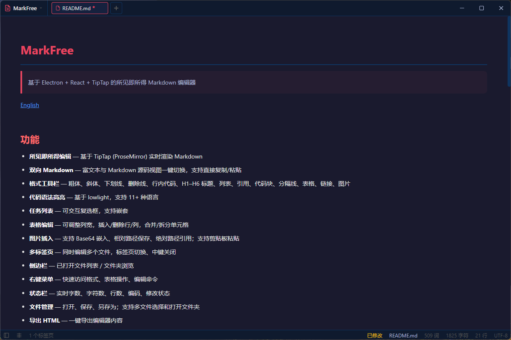

# MarkFree

> A WYSIWYG Markdown editor built with Electron, React, and TipTap

[中文文档](./README.md)



## Features

### Editing

- **WYSIWYG Editing** — TipTap-based rich text editor renders Markdown in real time
- **Source Mode** — Toggle raw Markdown editing with one click
- **Bidirectional Markdown** — Seamless switching between rich text and source view; copy/paste Markdown directly
- **Formatting Toolbar** — bold, italic, underline, strikethrough, inline code, H1–H6 headings, lists, blockquotes, code blocks, horizontal rules, tables, links, images
- **Context Menu** — right-click for formatting, table operations, editing commands
- **Math Formulas** — inline `$E=mc^2$` and display `$$\int_a^b f(x)dx$$` via KaTeX rendering
- **Code Syntax Highlighting** — powered by lowlight with 11+ languages
- **Task Lists** — interactive checkboxes with nesting support
- **Table Editing** — resizable columns, insert/delete rows/columns, merge/split cells
- **Image Insertion** — Base64 embedded, relative path, absolute path; paste from clipboard

### AI Assistant

- **AI Command Panel** — `Ctrl+K` to open; supports continuation, rewriting, translation, summarization, and more
- **Selection Actions** — select text and use AI to transform it
- **Cursor Insertion** — generate content at cursor position when no text is selected
- **Multi-model Support** — OpenAI, DeepSeek, Zhipu, Qwen, Ollama, and other API providers
- **Custom System Prompt** — configurable system prompt; AI is pre-configured for the editor's supported Markdown syntax

### Links & Navigation

- **Link Editing** — bubble menu on click to edit URL or remove links
- **Anchor Navigation** — `#anchor` links jump to corresponding headings in the document
- **Ctrl+Click** — open external links in default browser or built-in browser
- **Markdown File Links** — `.md` file links open inside the editor

### Files & Tabs

- **Multi-tab Editing** — edit multiple files simultaneously, tab switching, middle-click close
- **Sidebar** — open files list / folder browsing
- **File Management** — open, save, save as; multi-file selection, folder opening
- **Drag & Drop** — drag .md/.markdown files onto the window to open
- **Command-line Opening** — `MarkFree.exe example.md`
- **File Association** — register/unregister .md association (Windows)

### Appearance & Settings

- **Custom Title Bar** — frameless window with custom title bar and tab bar
- **Theme System** — dark (default) and light themes built in, custom CSS theme support
- **Font Settings** — customize editor font and size
- **Customizable Shortcuts** — customize keyboard shortcuts (new, open, save, sidebar, AI command panel, etc.)
- **Hardware Acceleration Toggle** — auto / always on / disabled
- **Window Modes** — center, auto-remember, fixed position
- **Default Open Path** — auto-open folder or file on startup
- **Spellcheck Toggle**
- **Toolbar Visibility Toggle**
- **Last Tab Behavior** — show welcome page or close app
- **Link Open Mode** — default browser / built-in browser

### Other

- **Status Bar** — real-time word count, character count, line count, encoding, modification status
- **Export HTML** — one-click export to HTML
- **Help Window** — help menu with software intro and editing guide
- **About Dialog** — version, tech stack, runtime info
- **Single Instance** — prevents multiple instances, forwards files to running instance

## Install

Download the latest installer from the [Releases](https://github.com/nihaozyj7/MarkFree/releases) page.

### Prerequisites

- Windows x64
- Node.js >= 18 (for development)

## Development

```bash
npm install
npm run generate-icon
npm run dev
npm run build
npm run pack:win
```

Packaged artifacts will be in the `dist/` directory.

## Project Structure

```
src/
  main/
    index.js              — Main process (window, IPC, themes, file assoc, single instance, AI, help window)
    ai/
      prompts.js          — AI system prompt and message builder
  preload/index.js        — contextBridge (electronAPI)
  renderer/
    index.html            — Entry HTML
    src/
      main.jsx            — React mount
      App.jsx             — Editor setup, extensions, multi-tab management
      config/editor.js    — TipTap extension configuration
      extensions/         — Custom extensions (CustomImage, MathInline, MathDisplay, HeadingId)
      components/
        TitleBar.jsx      — Title bar, tab bar, menu
        Toolbar.jsx       — Formatting toolbar
        Sidebar.jsx       — Sidebar
        StatusBar.jsx     — Status bar
        ContextMenu.jsx   — Right-click context menu
        AICommandInput.jsx— AI command panel
        LinkBubbleMenu.jsx— Link bubble menu
        SourceModeEditor.jsx — Source mode editor
        SettingsDialog.jsx   — Settings dialog
        AboutDialog.jsx      — About dialog
      styles/
        index.css         — Base styles
        editor.css        — Editor and UI styles
```

## Tech Stack

| Tech | Purpose |
| --- | --- |
| Electron 33 | Desktop framework |
| React 18 | UI |
| Vite 5 (electron-vite) | Build tool |
| TipTap 2 (ProseMirror) | Rich text engine |
| tiptap-markdown | Markdown ↔ WYSIWYG conversion |
| KaTeX | Math formula rendering |
| lowlight | Code syntax highlighting |

## License

MIT