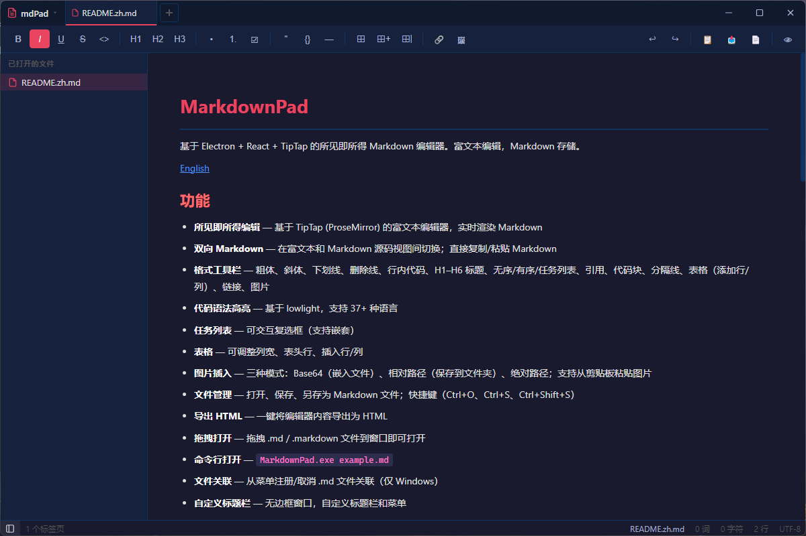

# MarkdownPad

基于 Electron + React + TipTap 的所见即所得 Markdown 编辑器。富文本编辑，Markdown 存储。

[English](./README.en.md)



## 功能

- **所见即所得编辑** — 基于 TipTap (ProseMirror) 的富文本编辑器，实时渲染 Markdown
- **双向 Markdown** — 在富文本和 Markdown 源码视图间切换；直接复制/粘贴 Markdown
- **格式工具栏** — 粗体、斜体、下划线、删除线、行内代码、H1–H6 标题、无序/有序/任务列表、引用、代码块、分隔线、表格（添加行/列）、链接、图片
- **代码语法高亮** — 基于 lowlight，支持 11+ 种语言
- **任务列表** — 可交互复选框（支持嵌套）
- **表格** — 可调整列宽、表头行、插入/删除行/列、合并/拆分单元格
- **图片插入** — 三种模式：Base64（嵌入文件）、相对路径（保存到文件夹）、绝对路径；支持从剪贴板粘贴图片
- **多标签页编辑** — 同时编辑多个文件，支持标签页切换、中键关闭
- **侧边栏** — 浏览已打开文件列表，或浏览文件夹中的 .md 文件
- **右键上下文菜单** — 在编辑区右键快速访问格式、表格操作、编辑命令
- **状态栏** — 实时显示字数、字符数、行数、编码、修改状态
- **撤销/重做** — 工具栏撤销重做按钮
- **文件管理** — 打开、保存、另存为 Markdown 文件；支持多文件选择和打开文件夹
- **导出 HTML** — 一键将编辑器内容导出为 HTML
- **拖拽打开** — 拖拽 .md / .markdown 文件到窗口即可打开
- **命令行打开** — `MarkdownPad.exe example.md`
- **文件关联** — 从菜单注册/取消 .md 文件关联（仅 Windows）
- **自定义标题栏** — 无边框窗口，自定义标题栏和菜单
- **主题系统** — 内置深色（默认）和浅色主题；在设置中选择，将 .css 文件放入主题文件夹即可添加自定义主题
- **字体设置** — 在设置中自定义编辑区字体和字号
- **快捷键自定义** — 在设置中自定义快捷键（新建、打开、保存、另存为、侧边栏）
- **硬件加速开关** — 在设置中切换硬件加速模式（自动/始终启用/禁用）
- **窗口模式** — 支持居中、自动记忆位置、固定位置三种窗口启动模式
- **默认打开路径** — 设置应用启动时自动打开的文件夹或文件
- **拼写检查开关** — 在设置中启用/关闭浏览器拼写检查
- **工具栏显示开关** — 在设置中显示/隐藏工具栏
- **标签页关闭行为** — 可设置关闭最后一个标签页时关闭应用或创建新标签页
- **关于对话框** — 查看应用版本、技术栈、运行环境信息
- **单实例锁** — 防止多开，将打开的文件转发到运行中的实例

## 安装

从 [Releases](https://github.com/anomalyco/markdownpad/releases) 页面下载最新安装程序。

### 环境要求

- Windows x64（NSIS 安装包）
- Node.js &gt;= 18（开发环境）

## 开发

```bash
# 安装依赖
npm install

# 生成应用图标
npm run generate-icon

# 启动开发服务器（热重载）
npm run dev

# 生产构建
npm run build

# 打包为 Windows 安装程序
npm run pack
```

打包后的安装程序位于 `release/` 目录。

## 项目结构

```
src/
  main/index.js              — Electron 主进程（窗口、IPC、主题、文件关联、单实例锁）
  preload/index.js           — contextBridge（为渲染进程暴露 electronAPI）
  renderer/
    index.html               — 入口 HTML
    src/
      main.jsx               — React 挂载点
      App.jsx                — 编辑器主体、所有扩展、多标签页管理、Markdown 预览
      components/
        TitleBar.jsx         — 自定义无边框标题栏、标签页栏、菜单
        Toolbar.jsx          — 格式工具栏
        Sidebar.jsx          — 侧边栏（文件列表 / 文件夹浏览）
        StatusBar.jsx        — 状态栏（字数、统计信息）
        ContextMenu.jsx      — 右键上下文菜单
        SettingsDialog.jsx   — 设置对话框（主题、字体、快捷键、硬件加速等）
        AboutDialog.jsx      — 关于对话框
      styles/
        index.css            — 重置样式 + 基础样式
        editor.css           — 编辑器、工具栏、预览、侧边栏、状态栏、滚动条样式
```

## 技术栈

| 技术 | 用途 |
| --- | --- |
| Electron 33 | 桌面应用框架 |
| React 18 | UI 框架 |
| Vite 5 (electron-vite) | 构建工具 |
| TipTap 2 (ProseMirror) | 富文本编辑引擎 |
| tiptap-markdown | Markdown ↔ WYSIWYG 互转 |
| lowlight | 代码语法高亮 |

## 许可

MIT

---

*本项目全程使用 [opencode](https://opencode.ai) 配合 DeepSeek V4 Flash 模型生成。*
