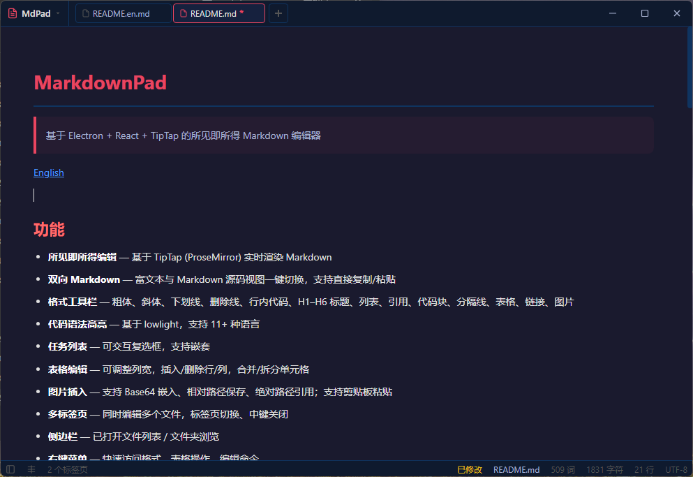

# MarkFree

> 基于 Electron + React + TipTap 的所见即所得 Markdown 编辑器

[English](./README.en.md)



## 功能

- **所见即所得编辑** — 基于 TipTap (ProseMirror) 实时渲染 Markdown
- **双向 Markdown** — 富文本与 Markdown 源码视图一键切换，支持直接复制/粘贴
- **格式工具栏** — 粗体、斜体、下划线、删除线、行内代码、H1–H6 标题、列表、引用、代码块、分隔线、表格、链接、图片
- **代码语法高亮** — 基于 lowlight，支持 11+ 种语言
- **任务列表** — 可交互复选框，支持嵌套
- **表格编辑** — 可调整列宽，插入/删除行/列，合并/拆分单元格
- **图片插入** — 支持 Base64 嵌入、相对路径保存、绝对路径引用；支持剪贴板粘贴
- **多标签页** — 同时编辑多个文件，标签页切换、中键关闭
- **侧边栏** — 已打开文件列表 / 文件夹浏览
- **右键菜单** — 快速访问格式、表格操作、编辑命令
- **状态栏** — 实时字数、字符数、行数、编码、修改状态
- **文件管理** — 打开、保存、另存为；支持多文件选择和打开文件夹
- **导出 HTML** — 一键导出编辑器内容
- **拖拽打开** — 拖拽 .md / .markdown 文件到窗口即可打开
- **命令行打开** — `MarkFree.exe example.md`
- **文件关联** — 注册/取消 .md 文件关联（Windows）
- **自定义标题栏** — 无边框窗口，自定义标题栏与标签页栏
- **主题系统** — 内置深色和浅色主题，支持自定义 CSS 主题
- **字体设置** — 自定义编辑区字体和字号
- **快捷键自定义** — 自定义快捷键（新建、打开、保存、侧边栏等）
- **硬件加速开关** — 自动 / 始终启用 / 禁用
- **窗口模式** — 居中、记忆位置、固定位置
- **默认打开路径** — 设置启动时自动打开的文件或文件夹
- **拼写检查开关**
- **工具栏显示开关**
- **标签页关闭行为** — 关闭最后一个标签页时关闭应用或新建标签页
- **关于对话框** — 版本、技术栈、运行环境
- **单实例锁** — 防止多开，文件转发至运行中实例

## 安装

从 [Releases](https://github.com/anomalyco/markfree/releases) 下载最新安装程序。

### 环境要求

- Windows x64
- Node.js &gt;= 18（开发环境）

## 开发

```bash
# 安装依赖
npm install

# 生成图标
npm run generate-icon

# 启动开发服务器（热重载）
npm run dev

# 生产构建
npm run build

# 打包 Windows 安装程序 + 绿色版
npm run pack:win
```

打包后的文件位于 `dist/` 目录。

## 项目结构

```
src/
  main/index.js              — 主进程（窗口、IPC、主题、文件关联、单实例）
  preload/index.js           — contextBridge 桥接层
  renderer/
    index.html               — 入口 HTML
    src/
      main.jsx               — React 入口
      App.jsx                — 编辑器主体、扩展注册、多标签页
      components/
        TitleBar.jsx         — 标题栏、标签页栏、菜单
        Toolbar.jsx          — 格式工具栏
        Sidebar.jsx          — 侧边栏
        StatusBar.jsx        — 状态栏
        ContextMenu.jsx      — 右键菜单
        SettingsDialog.jsx   — 设置对话框
        AboutDialog.jsx      — 关于对话框
      styles/
        index.css            — 基础样式
        editor.css           — 编辑器与 UI 样式
```

## 技术栈

| 技术 | 用途 |
| --- | --- |
| Electron 33 | 桌面框架 |
| React 18 | UI |
| Vite 5 (electron-vite) | 构建 |
| TipTap 2 (ProseMirror) | 富文本引擎 |
| tiptap-markdown | Markdown ↔ WYSIWYG 互转 |
| lowlight | 代码语法高亮 |

## 许可

MIT

---

*本项目全程使用 [opencode](https://opencode.ai) 配合 DeepSeek V4 Flash 模型生成。*